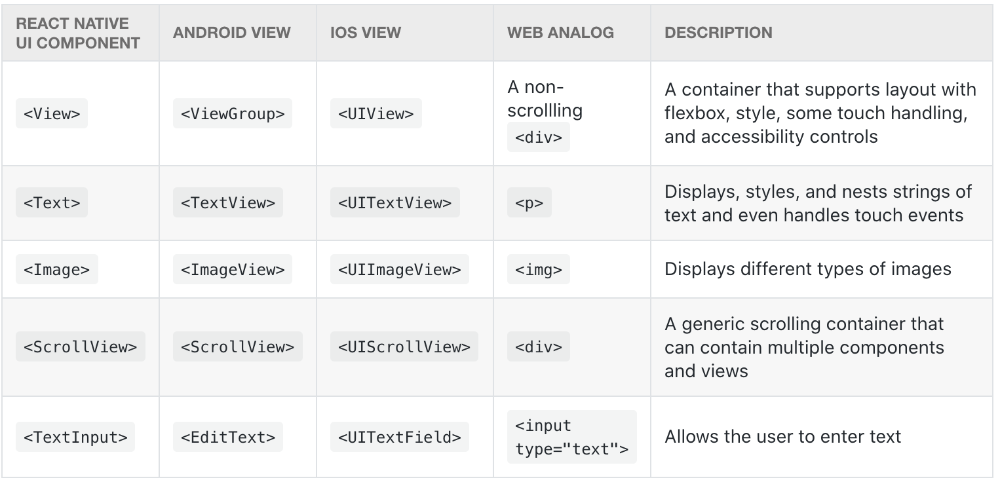

# Core Components and Native Components

React Native - это платформа с открытым исходным кодом для создания приложений для Android и iOS с использованием React и собственных возможностей платформы приложений. С React Native вы используете JavaScript для доступа к API вашей платформы, а также для описания внешнего вида и поведения вашего пользовательского интерфейса с помощью компонентов React: пакетов многоразового вложенного кода. Вы можете узнать больше о React в следующем разделе. Но сначала давайте рассмотрим, как компоненты работают в React Native.

## Views and mobile development

В разработке для Android и iOS представление является основным строительным блоком пользовательского интерфейса: небольшой прямоугольный элемент на экране, который можно использовать для отображения текста, изображений или ответа на ввод пользователя. Даже самые маленькие визуальные элементы приложения, такие как строка текста или кнопка, являются видами. Некоторые виды представлений могут содержать другие представления. Это просмотры до конца!

## Native Components

В разработке под Android вы пишете представления на Kotlin или Java; при разработке для iOS вы используете Swift или Objective-C. С React Native вы можете вызывать эти представления с помощью JavaScript, используя компоненты React. Во время выполнения React Native создает соответствующие представления Android и iOS для этих компонентов. Поскольку компоненты React Native поддерживаются теми же представлениями, что и Android и iOS, приложения React Native выглядят, работают и работают как любые другие приложения. Мы называем эти компоненты, поддерживаемые платформой, собственными компонентами.

React Native позволяет создавать собственные нативные компоненты для Android и iOS в соответствии с уникальными потребностями вашего приложения. У нас также есть процветающая экосистема этих компонентов, внесенных сообществом. Проверьте Native Directory, чтобы узнать, что создает сообщество.

React Native также включает набор основных, готовых к использованию нативных компонентов, которые вы можете использовать, чтобы начать создавать свое приложение уже сегодня. Это основные компоненты React Native.

## Core Components

React Native имеет множество основных компонентов для всего, от элементов управления формами до индикаторов активности. Вы можете найти их все в документации в разделе API. В основном вы будете работать со следующими основными компонентами:

В следующем разделе вы начнете комбинировать эти основные компоненты, чтобы узнать, как работает React. Поиграйте с ними прямо сейчас!

Поскольку React Native использует ту же структуру API, что и компоненты React, вам необходимо понимать API компонентов React, чтобы начать работу. Следующий раздел предназначен для быстрого введения или повторения темы. Однако, если вы уже знакомы с React, можете пропустить.
